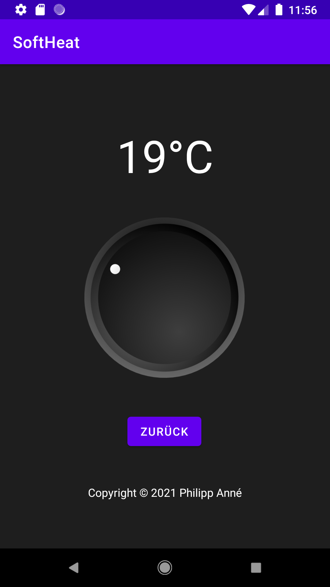

# SoftHeat

## Description

During the renovation of the last room in our house, I unfortunately forgot to lay a cable for the control of the floor heating.

The obvious solution is of course to switch the thermostats with [Shelly](https://shelly.cloud) relays and connect them via a [Raspberry Pi Zero W](https://www.raspberrypi.org/products/raspberry-pi-zero-w/) using MQTT.
The actual control runs on an [NodeMCU ESP8266](https://de.wikipedia.org/wiki/NodeMCU), which can also be addressed via MQTT.

This Android app is used to conveniently set the target temperature of the control. It can only be used in our local WLAN.

## Technical

There is not much to see here.

The project is built on one of the standard templates from AndroidStudio.
The MQTT connection is done via the [Eclipse Paho](https://github.com/eclipse/paho.mqtt.android) framework.

The nice knob comes from another [GitHub project](https://github.com/o4oren/kotlin-rotary-knob) and is just extended by a little something.

To actually use the app, an mqtt.properties file must be added as an asset. The necessary properties can be taken from the MqttHelper class.

## Screenshots

The main app view

Setting the temperature

## License

Copyright (c) 2021 Philipp Anné

This project is licensed under the terms of the [MIT license](./LICENSE).
